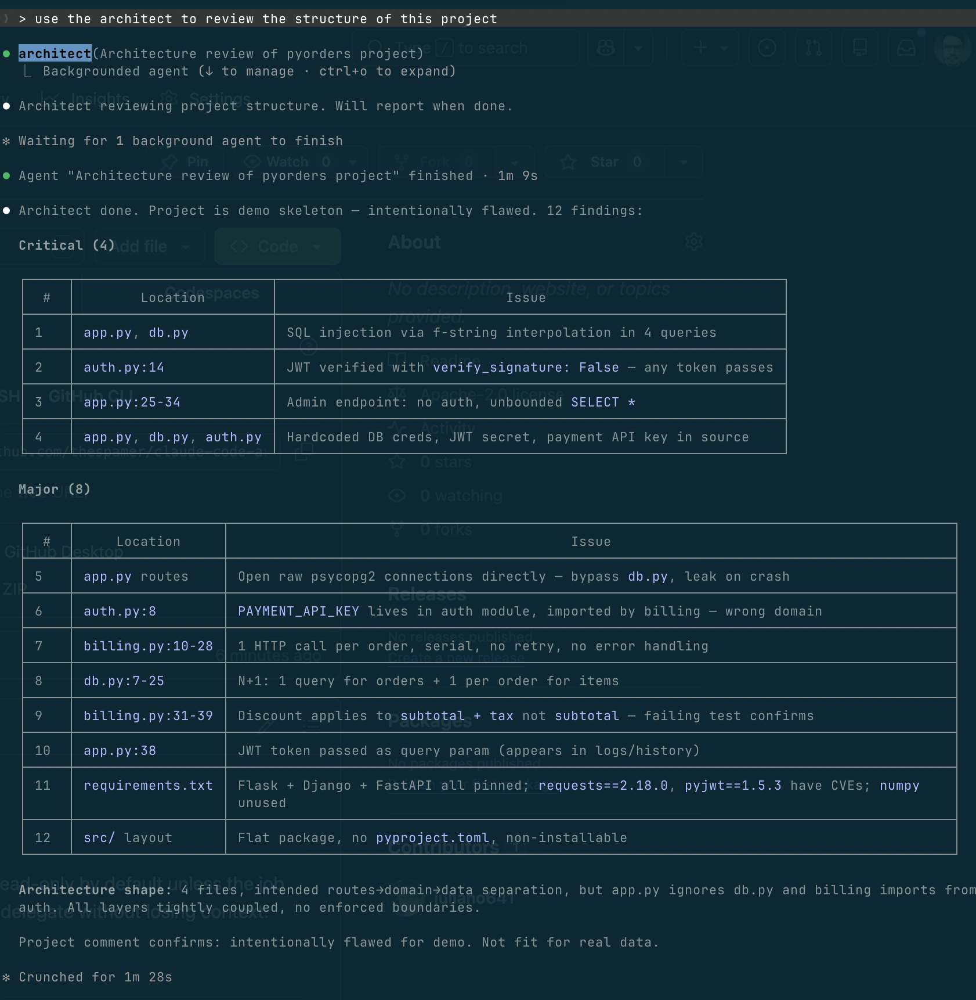
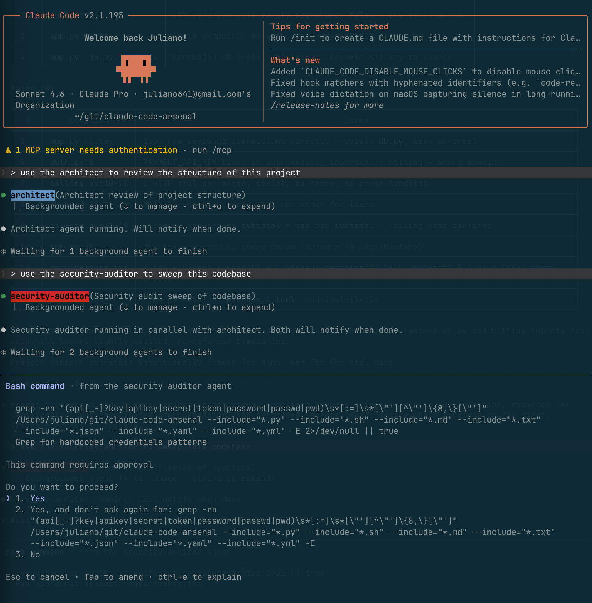
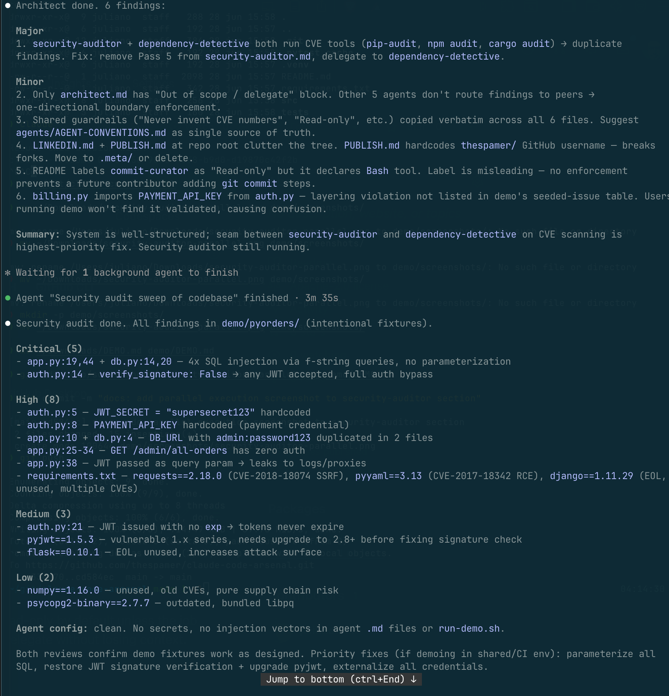
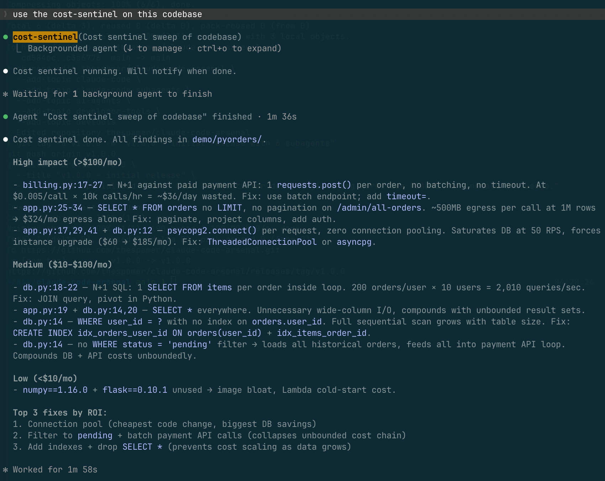
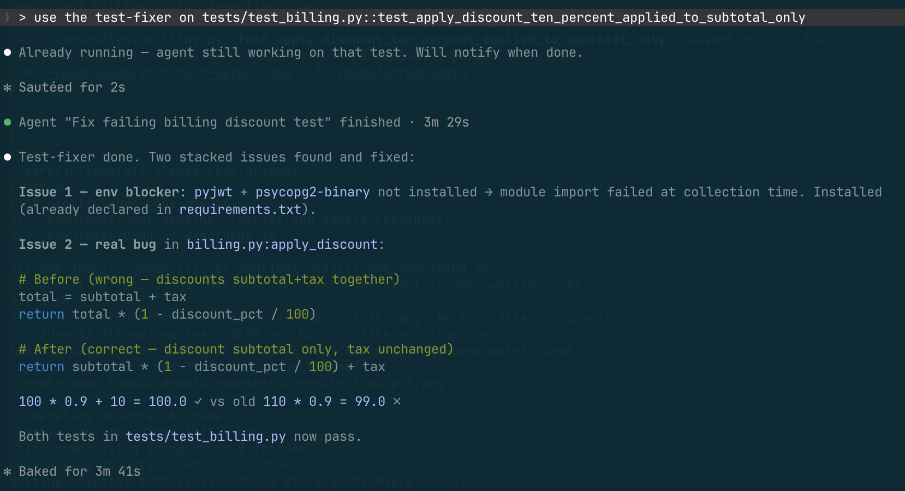
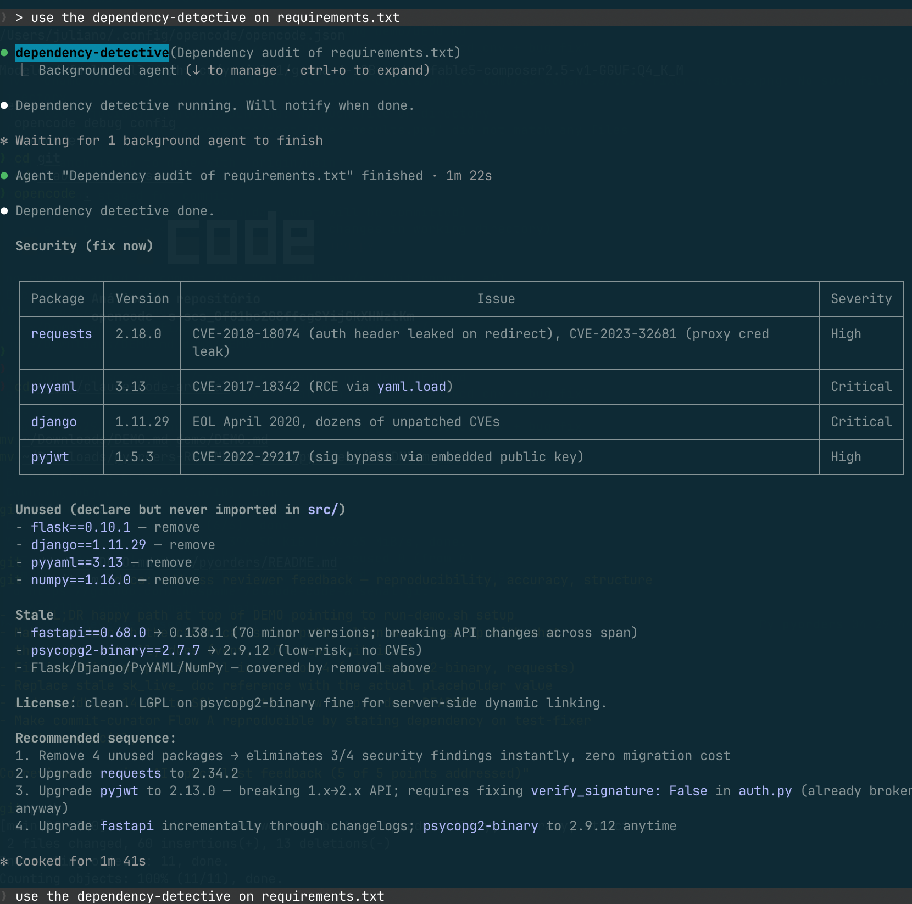

# Demo walkthrough — see all six agents in action

This walkthrough uses the small flawed FastAPI project under `demo/pyorders/`.
It is intentionally seeded with one or more issues per agent so you can run
each agent and see a real finding.

---

## TL;DR — happy path in 5 minutes

If you just want to see the agents run, do this:

```bash
# 1. From the repository root, run the setup script.
#    Installs the six subagents to ~/.claude/agents/,
#    creates a venv with all test dependencies (pytest, fastapi,
#    pyjwt, psycopg2-binary, requests), and inits git inside the
#    demo project.
./demo/run-demo.sh setup

# 2. Print the ordered list of prompts to paste into Claude Code.
./demo/run-demo.sh prompts

# 3. Open Claude Code inside the demo project.
cd demo/pyorders
claude
```

Inside Claude Code, paste each of the prompts printed by `run-demo.sh prompts` in order, waiting for one to finish before pasting the next. Total time: ~10 minutes for all six agents.

The rest of this document is the deep dive: what each agent finds, why it matters, and what real runs produced. Use the agent sections below as reference while you go through the prompts.

---

## Setup details (if you skipped the TL;DR)

The `run-demo.sh setup` script is the canonical path because it gets four things right that the demo depends on downstream:

- Installs subagents user-level so they show up under `/agents` inside Claude Code
- Creates a `.venv` and installs all four runtime deps the demo code imports (`pytest`, `fastapi`, `pyjwt`, `psycopg2-binary`, `requests`) — missing any of these makes pytest fail at collection time before any test runs
- Initializes git inside `demo/pyorders/` so the `commit-curator` has a real repository to read staged changes from
- Verifies the failing test fails before you start (sanity check that the seeded bug is in place)

If you prefer to set up manually, mirror what the script does:

```bash
# From the root of claude-code-arsenal
mkdir -p ~/.claude/agents
cp agents/*.md ~/.claude/agents/

cd demo/pyorders
python3 -m venv .venv
source .venv/bin/activate
pip install pytest fastapi pyjwt psycopg2-binary requests
git init && git add . && git commit -m "chore: initial demo skeleton"
pytest tests/ -v   # confirm 1 failed, 1 passed
claude             # open Claude Code in this directory
```

Inside Claude Code, confirm the agents loaded:

```
/agents
```

You should see the six listed under Personal scope.

## The demo app in 30 seconds

```
demo/pyorders/
├── requirements.txt          # mix of vulnerable, stale, redundant, unused deps
├── src/
│   ├── app.py                # FastAPI handlers with layering issues + SQL injection
│   ├── auth.py               # hardcoded JWT secret, hardcoded API key, JWT not verified
│   ├── db.py                 # N+1 query pattern + SQL injection in 2 places
│   └── billing.py            # N+1 external API + real discount bug
└── tests/
    └── test_billing.py       # one passing test, one failing test (catches the bug)
```

Total surface area: about 130 lines of Python. Small enough to read in two minutes, broken enough to give every agent something real to do. The full list of seeded issues with `file:line` references lives in [`pyorders/README.md`](pyorders/README.md).

---

## 1. architect

```
> use the architect to review the structure of this project
```

**Real output from an actual run** (Claude Code v2.1.195, Sonnet 4.6):



The agent finished in 1m 28s and returned 12 findings organized by severity, plus an "architecture shape" summary at the bottom identifying the layering breakdown (`app.py ignores db.py`, `billing imports from auth`). Note the agent crosses scope slightly — items 1-4 and 11 properly belong to `security-auditor` and `dependency-detective`. That cross-coverage is expected when running agents individually; the other agents will reconfirm those findings in their own runs.

**What it finds:**

- `src/app.py` imports `psycopg2` and runs raw SQL directly from HTTP handlers. The web layer is talking to the database. There is no service layer, no repository, no domain model.
- `src/billing.py` mixes domain logic (`apply_discount`) with adapter concerns (HTTP calls to the payment provider). Two responsibilities in one module.
- `src/db.py` re-declares `DB_URL` instead of pulling from a single config source. Connection strings live in two files.
- No `__init__.py`-level public API. Internal modules are imported by absolute path from anywhere.

**Expected output shape:**

```
## Architectural findings

### Major
- src/app.py:21 — handlers execute SQL directly against psycopg2.
  Why it matters: every schema change ripples through the HTTP layer.
  Recommendation: extract a `repositories/` module; handlers call repositories, not the driver.

- src/billing.py — domain and adapter concerns in one file.
  Why it matters: testing `apply_discount` should not require mocking HTTP.
  Recommendation: split into `billing/domain.py` (pure) and `billing/payment_adapter.py` (HTTP).

### Minor
- src/db.py:4 and src/app.py:10 — DB_URL duplicated in two modules.
  Recommendation: single `src/config.py` reading from environment.

## Shape of the system
A FastAPI service for orders, currently written as four flat modules with
no layering. Web handlers reach directly into the database driver and into
a billing module that also speaks to a payment API. A new engineer would
read this as "a script with HTTP routes," not as a service.
```

---

## 2. security-auditor

```
> use the security-auditor to sweep this codebase
```

**Tip — parallel execution.** Subagents run as background tasks in Claude Code, so you can dispatch the next one without waiting for the previous to finish. Below, `architect` and `security-auditor` are running concurrently, and the security-auditor has started its first pass with the credentials-grep from its system prompt:



Two things worth noting in that screenshot:

1. The grep regex (`(api[_-]?key|apikey|secret|token|password|passwd|pwd)\s*[:=]\s*["'][^"']{8,}["']`) is the one defined in `agents/security-auditor.md` under Pass 1. The agent is executing the spec from its system prompt verbatim.
2. Claude Code prompts you to approve the Bash command before it runs. This is the built-in approval flow for subagent tool use, not a special feature of this arsenal. Useful guardrail — you see what the agent wants to do before it does it.

**What it finds:**

- `src/auth.py:5` — JWT_SECRET hardcoded.
- `src/auth.py:8` — `PAYMENT_API_KEY` hardcoded in source. The literal value is an explicit placeholder (`"Your_token_from_istripe_HERE"`) — it would not work against a real provider, but it is still detected by the agent's regex because the variable name matches the credentials pattern.
- `src/auth.py:14` — `jwt.decode(..., options={"verify_signature": False})`. Tokens accepted without signature verification.
- `src/app.py:13` — `DB_URL` contains the password in source.
- `src/app.py:21, 30, 41` — SQL injection via f-string interpolation in three places.
- `src/app.py:27` — `/admin/all-orders` has no `Depends(verify_token)` or equivalent.
- `requirements.txt` — `requests==2.18.0` (CVE-2018-18074), `pyyaml==3.13` (CVE-2017-18342), `django==1.11.29` (multiple CVEs).

**Expected output shape:**

```
## Security findings

### CRITICAL
- src/app.py:21,30,41 (input handling) — SQL injection via f-string in three handlers.
  Risk: any client can read or modify arbitrary data in the orders database.
  Fix: use parameterized queries (psycopg2 supports `cur.execute(sql, params)`).

- src/auth.py:14 (authentication) — JWT signature verification disabled.
  Risk: forged tokens accepted; any user identity can be impersonated.
  Fix: `jwt.decode(token, JWT_SECRET, algorithms=["HS256"])` and remove the options dict.

- src/auth.py:5,8 (secrets) — JWT secret and payment API key hardcoded.
  Risk: anyone with repo read access has prod credentials.
  Fix: load from environment; rotate both keys immediately.

### HIGH
- src/app.py:27 (authorization) — admin route has no auth dependency.
- requirements.txt — three packages with known CVEs.

3 critical, 2 high, 0 medium, 0 low.
Blocking items: parameterized queries, JWT verification, secret rotation.
```

**Real output from an actual run** (Sonnet 4.6, 3m 35s):



The actual agent run was more thorough than the predicted shape above. It found:

- **5 critical** (4× SQL injection — including `db.py:14,20` which the prediction missed — plus full JWT bypass)
- **8 high** including two that were not in the seeded-issue table:
  - `app.py:38` — JWT passed as a query parameter, which leaks into request logs, proxy access logs, and browser history
  - `requirements.txt` finding includes specific CVE classifications (`requests==2.18.0` flagged as SSRF, `pyyaml==3.13` as RCE)
- **3 medium** caught what the prediction missed entirely:
  - `auth.py:21` — JWT issued without an `exp` claim, so tokens never expire
  - `pyjwt==1.5.3` — the agent identified an upgrade ordering dependency: pyjwt must be bumped to 2.x **before** re-enabling signature verification, otherwise the fix introduces a different break
- **2 low** for supply chain hygiene
- **Agent config sweep** — the auditor also checked `agents/*.md` and `run-demo.sh` for secrets or injection vectors, found none. The agent verified its own tooling, not just the target codebase.

> **Meta moment:** the upper portion of the screenshot shows the `architect` agent finishing a parallel review of the entire arsenal repo (not just `demo/pyorders/`). With the "Out of scope" section now in `agents/architect.md`, it correctly stayed within architectural concerns and surfaced six meta-findings about the arsenal itself, the top one being a real overlap: `security-auditor` Pass 5 and `dependency-detective` both run CVE scanners, producing duplicate findings. That overlap is on the list to fix in v1.1.

---

## 3. cost-sentinel

```
> use the cost-sentinel on this codebase
```

**What it finds:**

- `src/db.py:11-23` — N+1 query against the database. One query for orders, then one query per order for items.
- `src/billing.py:14-25` — N+1 against a paid external API. One `requests.post` per pending order, no batching.
- `src/app.py:30` — `SELECT * FROM orders` with no `LIMIT` and no pagination. At 1M rows this returns the whole table.
- `src/app.py:21,30,41` — `SELECT *` instead of named columns. Wide rows pulled across the wire.
- `src/billing.py:18` — no retry budget, no idempotency key on the payment call.

**Expected output shape:**

```
## Cost findings

### High impact (>$100/month at moderate scale)
- src/billing.py:14-25 — per-order call to the payment API inside a loop.
  Why expensive: provider charges per call; at 10K orders/day this is 300K paid calls/month.
  Estimated impact: $300-3000/month depending on per-call price.
  Mitigation: batch endpoint if the provider has one; otherwise enqueue and dedupe.

- src/app.py:30 — unbounded SELECT * on the orders table from an HTTP handler.
  Why expensive: full table scan + full row serialization on every admin page load.
  Mitigation: add LIMIT/OFFSET pagination, project the columns the UI actually uses.

### Medium impact
- src/db.py:11-23 — N+1 on items query.
  Mitigation: single JOIN, or `WHERE order_id = ANY(%s)` with the order ID list.

Top three interventions: batch payment calls, paginate admin queries, JOIN items.
```

**Real output from an actual run** (Sonnet 4.6, 1m 58s):



This was the cleanest agent output in the demo. Three things worth calling out:

1. **Every dollar figure carries an assumption.** "$0.005/call × 10k calls/hr = ~$36/day", "~500MB egress per call at 1M rows → $324/mo", "$60 → $185/mo instance upgrade at 50 RPS". The guardrail in `agents/cost-sentinel.md` ("never quote a precise dollar figure without stating the assumption") was followed without exception.

2. **The agent stayed in scope without an explicit "Out of scope" block.** No security findings, no architecture commentary, no dependency review (except where unused deps create real cost — Lambda cold-start image bloat).

3. **Three high-impact findings were not in the seeded-issue table:**
   - **`app.py:17,29,41 + db.py:12`** — `psycopg2.connect()` per request, zero connection pooling. Saturates DB at 50 RPS, forces instance upgrade. This is a classic anti-pattern that does not show up in a "what's broken" checklist because the code looks normal in isolation.
   - **`db.py:14`** — missing `WHERE status = 'pending'` filter compounds with the N+1: the loop loads all historical orders for the user, then sends every one of them through the paid payment API. The agent identified a compounding cost chain across two files.
   - **`numpy + flask` unused → image bloat → Lambda cold-start cost.** A different cost model entirely from the API and DB findings, and the agent surfaced it.

4. **The ROI ranking at the end** ordered interventions by code-change cost vs cost savings: connection pool first (smallest change, biggest impact), filter + batch second (collapses the unbounded chain), indexes + projection third (prevents scaling problems). That ordering is exactly the kind of judgment the system prompt asks for, and it would be hard to produce by pattern-matching alone.

---

## 4. test-fixer

First run the test suite to see the failure. If you followed the TL;DR setup, the venv is already active and dependencies are installed; just run pytest. Otherwise, install all four runtime deps the code actually imports:

```bash
cd demo/pyorders
source .venv/bin/activate                                          # if run-demo.sh setup created the venv
# or, manual setup:
pip install pytest fastapi pyjwt psycopg2-binary requests          # all four are required

pytest tests/ -v
```

You will see `test_apply_discount_ten_percent_applied_to_subtotal_only` fail. Then:

```
> use the test-fixer on tests/test_billing.py::test_apply_discount_ten_percent_applied_to_subtotal_only
```

**What it finds:**

The test expects `100.0`. The function returns `99.0`. Test is correct (discount applies to subtotal only, per the docstring contract). The production code is wrong: it adds tax first, then discounts the total.

**Expected output shape:**

```
## Diagnosis
Bucket: Real bug in production code.
Root cause: apply_discount applies the discount percentage to (subtotal + tax)
instead of to subtotal alone.

## Fix
File: src/billing.py
Change: compute discounted subtotal first, then add tax on top.
Rationale: matches the contract in the docstring and the finance team's
reconciliation requirement.

## Verification
- tests/test_billing.py::test_apply_discount_ten_percent_applied_to_subtotal_only: PASS
- tests/test_billing.py: PASS (2/2)
```

The fix diff the agent applies will look like:

```diff
-    total = subtotal + tax
-    return total * (1 - discount_pct / 100)
+    discounted_subtotal = subtotal * (1 - discount_pct / 100)
+    return discounted_subtotal + tax
```

**Real output from an actual run** (Sonnet 4.6, 3m 29s):



This run is the most instructive of the demo because the agent encountered **two stacked failures** and worked through them in order rather than blocking on the first.

1. **Issue 1 — environmental blocker.** `pyjwt` and `psycopg2-binary` were declared in `requirements.txt` but not installed in the active environment, so pytest failed at collection time with `ModuleNotFoundError` before any assertion ran. The agent recognized this matches bucket 5 (Environmental) from its system prompt — "missing env var, missing service, wrong version. Document the prerequisite." It installed the missing packages and re-ran.

2. **Issue 2 — real bug in production code.** With the environment fixed, the actual assertion failure surfaced: `99.0 != 100.0`. The agent classified as bucket 1 (real bug), changed two lines in `src/billing.py`, and verified both tests pass:

   ```diff
   -    total = subtotal + tax
   -    return total * (1 - discount_pct / 100)
   +    return subtotal * (1 - discount_pct / 100) + tax
   ```

   The arithmetic check at the bottom of the screenshot — `100 * 0.9 + 10 = 100.0 ✓ vs old 110 * 0.9 = 99.0 ✗` — is the kind of concrete verification that prevents the agent from declaring success while the test is still broken in a different way.

**What this validates about the agent design.** The six-bucket classification in `agents/test-fixer.md` (Real bug / Stale test / Flaky / Pollution / Environmental / Wrong assertion) is not just diagnostic structure on paper — it lets the agent recognize compound failures and address them in order. A less structured prompt would have either (a) reported "test fails at collection, environment broken, cannot proceed" and stopped, or (b) jumped straight to editing `apply_discount` without first making the test runnable.

---

## 5. dependency-detective

```
> use the dependency-detective on requirements.txt
```

**What it finds:**

```bash
# the agent will run, when available:
pip-audit -r requirements.txt
```

- `requests==2.18.0` — CVE-2018-18074, fixed in 2.20.0.
- `pyyaml==3.13` — CVE-2017-18342, fixed in 5.1.
- `django==1.11.29` — EOL April 2020, multiple CVEs.
- `pyjwt==1.5.3` — two majors behind (current is 2.x).
- `flask==0.10.1` alongside `fastapi==0.68.0` — two web frameworks, pick one.
- `numpy==1.16.0` — declared but no `import numpy` in `src/`.

**Expected output shape:**

```
## Dependency audit

### Security (now)
- requests==2.18.0 — CVE-2018-18074, fixed in 2.20.0. Used by src/billing.py.
- pyyaml==3.13 — CVE-2017-18342, fixed in 5.1. No usage found, candidate for removal.
- django==1.11.29 — EOL, multiple CVEs. No usage found, candidate for removal.

### Stale
- pyjwt==1.5.3 → latest 2.x. Two majors behind. Breaking changes in 2.0.

### Redundant
- flask and fastapi both present. Used by: only fastapi imported in src/. Remove flask.

### Unused
- numpy in requirements, no imports in src/. Safe to remove.

Sequence: remove unused first (django, pyyaml, numpy, flask), then upgrade requests,
then plan pyjwt 2.x migration.
```

**Real output from an actual run** (Sonnet 4.6, 1m 22s):



This run produced four things worth noting:

1. **The agent picked a tabular layout for Security findings on its own.** The system prompt asks for a bullet list. The model chose `Package | Version | Issue | Severity` columns because a four-column matrix reads better than five separate bullets when comparing across rows. The prompt is followed in spirit (file:line equivalent = package@version, severity classification, fix path) but the format was upgraded by the model. Worth keeping rather than fighting.

2. **CVE coverage was deeper than predicted.** Beyond the seeded CVEs:
   - `requests==2.18.0` — adds **CVE-2023-32681** (proxy credential leak) on top of the predicted CVE-2018-18074
   - `pyjwt==1.5.3` — surfaces **CVE-2022-29217** (signature bypass via embedded public key), classified as High. This directly connects to the `verify_signature: False` in `auth.py`.
   - `pyyaml==3.13` classified as **Critical** (RCE), not just "vulnerable"
   - `django==1.11.29` classified as **Critical** (EOL, dozens of unpatched CVEs)

3. **Cross-agent convergence on upgrade ordering.** Recommendation #3 reads: *"Upgrade pyjwt to 2.13.0 — breaking 1.x→2.x API; requires fixing `verify_signature: False` in auth.py (already broken anyway)"*. This is the same ordering insight the `security-auditor` produced in its run (pyjwt 1.x → 2.x must come before re-enabling signature check). Two independent agent runs converged on the same chained fix sequence, which is a useful signal that the insight is real rather than an artifact of one prompt.

4. **ROI-ranked sequence as the final output.** The "Recommended sequence" at the end mirrors the structural pattern from cost-sentinel: smallest-cost intervention first (remove 4 unused packages → eliminates 3/4 of security findings at zero migration cost), then ordered by blast radius. Three of the six agents in this arsenal end with an ROI ranking; the pattern is intentional.

**One small miss to fix in v1.1.** The agent did not classify `flask==0.10.1` as redundant with `fastapi` (the seeded "redundancy" issue from `pyorders/README.md`). It correctly identified flask as unused, but the framing was "remove because not imported" rather than "remove because fastapi already covers this role". The system prompt has a "Redundancy" section that the model did not trigger — likely because the unused check fired first. Worth tightening the prompt to detect redundancy independent of import status.

---

## 6. commit-curator

Set up a small staging area, then invoke. Two flows shown below.

### Flow A — clean single-purpose commit

This flow assumes you ran the `test-fixer` in section 4, which leaves `src/billing.py` modified but not committed. If you skipped section 4, apply any small focused change to a single file before continuing.

```bash
cd demo/pyorders
# Git is already initialized (run-demo.sh setup did it; if you set up manually,
# you ran `git init && git add . && git commit -m "..."`).

# The test-fixer modified src/billing.py with the apply_discount fix.
# Stage that change:
git status              # confirm src/billing.py shows as modified
git add src/billing.py
```

Then in Claude Code:

```
> use the commit-curator on my staged changes
```

**Expected output:**

```
fix(billing): apply discount to subtotal before adding tax

The previous implementation discounted the total including tax, which
understated the tax owed on every discounted order. Finance reconciliation
flagged the mismatch.

Run `git commit -F-` and paste the block above.
```

### Flow B — staged area with two unrelated changes (the curator should refuse)

```bash
git add src/billing.py README.md
```

(Where `src/billing.py` is the fix and `README.md` adds a "running locally" section.)

```
> use the commit-curator on my staged changes
```

**Expected output:**

```
This staging area contains two unrelated changes. Recommend splitting:

Commit 1 (fix):
  git reset && git add src/billing.py
  → fix(billing): apply discount to subtotal before adding tax

Commit 2 (docs):
  git add README.md
  → docs: add running-locally section

Run the curator again after each split.
```

See `demo/sample-staged-diff.md` for the captured diff that triggers Flow B.

---

## What "watching it work" looks like

If you want to capture this for sharing (LinkedIn, internal demo), the
flow that reads best is:

1. Open a terminal with `claude` running in `demo/pyorders/`.
2. Run each agent in the order above, one per screen.
3. After agents 1-3 (read-only audits), run `pytest tests/ -v` to show the
   real failing test, then run agent 4 to fix it.
4. End with agent 6 on a clean commit, then agent 6 again on a mixed
   stage to show the refusal.

The full sequence takes about 5 minutes. The signal is the cumulative
quality and specificity of the findings, not any one agent in isolation.
